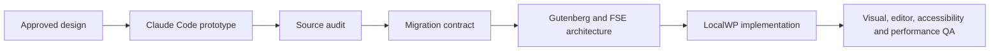

# Transform Claude Code prototypes into Gutenberg FSE

[](https://github.com/vicunav/vicunav-transform-claude-to-gutenberg/actions/workflows/validate.yml)
[](LICENSE)

An agent skill for turning approved frontend prototypes from Claude Code into
native WordPress block themes that remain editable through Gutenberg and Full
Site Editing (FSE).

This project treats the frontend prototype as a visual and functional
specification. It does not paste generated HTML into Custom HTML blocks or ship
the original React runtime inside WordPress. Instead, it guides the translation
into `theme.json`, block templates, template parts, patterns, core blocks, and
purpose-built plugins or custom blocks only when the contract requires them.

## Why this exists

Design-to-code tools can produce polished React, Next.js, Vite, HTML, and CSS
prototypes quickly. A production-quality WordPress implementation has a
different contract:

- editors must be able to change content safely;
- frontend and Site Editor styles must agree;
- business logic must not leak into the theme;
- responsive behavior, accessibility, and performance must survive the
  translation;
- local operations must preserve existing WordPress content and settings.

The skill makes those architectural decisions explicit and verifies the result
instead of treating a visual render as proof of a successful migration.

## Workflow



The workflow covers:

1. deterministic inspection of the source project;
2. baseline capture across desktop, tablet, mobile, and interactive states;
3. content, asset, token, interaction, and integration inventory;
4. translation to core blocks, patterns, templates, and template parts;
5. escalation to a custom block or plugin only after a concrete limitation;
6. safe installation and idempotent content operations in LocalWP;
7. visual comparison plus Gutenberg, accessibility, security, and performance
   gates.

## What this project demonstrates

- frontend architecture analysis across React, Next.js, Vite, HTML, and CSS;
- WordPress block theme engineering with `theme.json` and FSE;
- separation of presentation, editorial content, interactions, and business
  logic;
- LocalWP and WP-CLI operational safety;
- WCAG 2.1 AA, responsive, security, and performance review;
- reusable agent workflows backed by deterministic Node.js validators.

## Repository layout

```text
skills/transform-claude-to-gutenberg/
├── SKILL.md
├── agents/openai.yaml
├── references/
│   ├── localwp.md
│   ├── migration-manifest.md
│   ├── qa-checklist.md
│   ├── source-contract.md
│   ├── translation-map.md
│   └── upstream.md
└── scripts/
    ├── audit_source.mjs
    ├── capture_visual_evidence.mjs
    ├── compare_visual_evidence.mjs
    ├── validate_migration_manifest.mjs
    ├── validate_fse_theme.mjs
    ├── verify_visual_evidence.mjs
    └── visual_evidence_lib.mjs
```

## Requirements

- Node.js 20 or newer for the bundled scripts;
- Chromium installed through the pinned Playwright version for visual capture;
- a coding agent that supports Agent Skills, such as Codex or Claude Code;
- a WordPress environment for implementation and visual verification;
- LocalWP and WP-CLI when following the LocalWP workflow.

The skill delegates WordPress-specific procedures to four skills from the
official [WordPress Agent Skills](https://github.com/WordPress/agent-skills)
repository:

- `wp-project-triage`;
- `wp-block-themes`;
- `wp-block-development`;
- `wp-wpcli-and-ops`.

Install those skills using the upstream instructions before running a complete
migration.

## Installation

Clone this repository:

```bash
git clone https://github.com/vicunav/vicunav-transform-claude-to-gutenberg.git
cd vicunav-transform-claude-to-gutenberg
npm ci
npx playwright install chromium
```

For Codex, link the skill into the personal skills directory:

```bash
mkdir -p "$HOME/.codex/skills"
ln -s "$PWD/skills/transform-claude-to-gutenberg" \
  "$HOME/.codex/skills/transform-claude-to-gutenberg"
```

For Claude Code, use its personal skills directory:

```bash
mkdir -p "$HOME/.claude/skills"
ln -s "$PWD/skills/transform-claude-to-gutenberg" \
  "$HOME/.claude/skills/transform-claude-to-gutenberg"
```

Restart or begin a new agent session after installation.

## Usage

Invoke the skill with the source project and authorized LocalWP site paths:

```text
Use $transform-claude-to-gutenberg to audit this Claude Code project and create
a migration contract for my LocalWP site.
```

For a complete implementation:

```text
Use $transform-claude-to-gutenberg to transform this approved restaurant
prototype into a native FSE block theme using core blocks and local assets.
```

The agent should stop for decisions that change content, architecture,
functionality, licensing, or the approved design. It should discover ordinary
filesystem and local-environment facts without asking the user to provide them.

## Bundled commands

Audit a source project:

```bash
node skills/transform-claude-to-gutenberg/scripts/audit_source.mjs \
  /path/to/frontend-project
```

Validate an FSE theme:

```bash
node skills/transform-claude-to-gutenberg/scripts/validate_fse_theme.mjs \
  /path/to/wp-content/themes/example-theme
```

Validate the required migration manifest and evidence index:

```bash
node skills/transform-claude-to-gutenberg/scripts/validate_migration_manifest.mjs \
  /path/to/migration-manifest.json
```

Capture and compare the indexed source and target states, then run the final gate:

```bash
npm ci
npx playwright install chromium
node skills/transform-claude-to-gutenberg/scripts/capture_visual_evidence.mjs \
  /path/to/migration-manifest.json
node skills/transform-claude-to-gutenberg/scripts/compare_visual_evidence.mjs \
  /path/to/migration-manifest.json
node skills/transform-claude-to-gutenberg/scripts/verify_visual_evidence.mjs \
  /path/to/migration-manifest.json
```

Run the repository checks:

```bash
npm run validate
```

## Privacy and publication safety

The repository contains no demo content, database exports, screenshots,
credentials, personal paths, or private project artifacts. When using the
skill, keep production data, customer information, WordPress salts, API keys,
and licensed assets outside prompts and version control.

## Upstream and attribution

This project builds on public WordPress documentation and interoperates with
[WordPress Agent Skills](https://github.com/WordPress/agent-skills), licensed
under GPL-2.0-or-later. Those upstream skills remain separate dependencies so
their authorship, updates, and validation history stay intact.

The workflow was also informed by the experimental
[Automattic WordPress Agent Skill Prototypes](https://github.com/Automattic/wordpress-agent-skills).
No code, prompts, or assets from that repository are included here.

WordPress, LocalWP, Claude, Claude Code, and Codex are trademarks or product
names of their respective owners. This independent project is not endorsed by
or affiliated with those companies.

## License

GPL-2.0-or-later. See [LICENSE](LICENSE).
